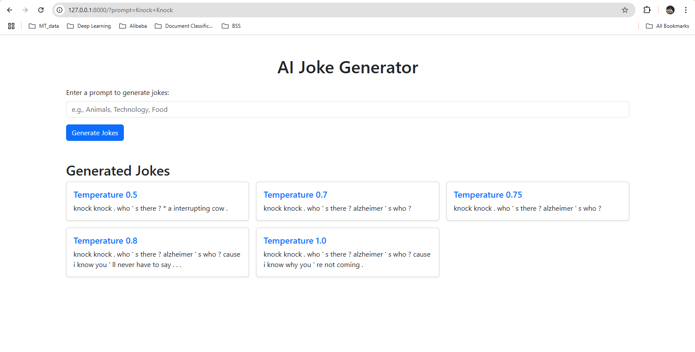

# NLP-A2-st124973

github -> https://github.com/FrancisPhone/NLP-A2-st124973
Notebook -> LSTM_LM_st124973.ipynb
dataset -> https://huggingface.co/datasets/Maximofn/short-jokes-dataset
model_files -> https://drive.google.com/drive/folders/1bKdPULE8PLJVw1huUkETS6Va2n5Kym5E?usp=drive_link

# APP Information
1. python -m venv .venv/
2. pip install -r requirements.txt
3. cd app/
4. python manage.py runserver

# Model Information
train_size = 185325
valid_size = 23166
test_size = 23166
vocab_size = 30068
batch_size = 128
emb_dim = 1024              
hid_dim = 1024               
num_layers = 2                
dropout_rate = 0.65              
lr = 1e-3 
n_epochs = 50
seq_len  = 50
clip    = 0.25
training_duration ~ 5 hours
Train Perplexity= 34.000
Valid Perplexity= 49.123
Test Perplexity= 48.228

## Don't forget to save model and vocabularies after training!

